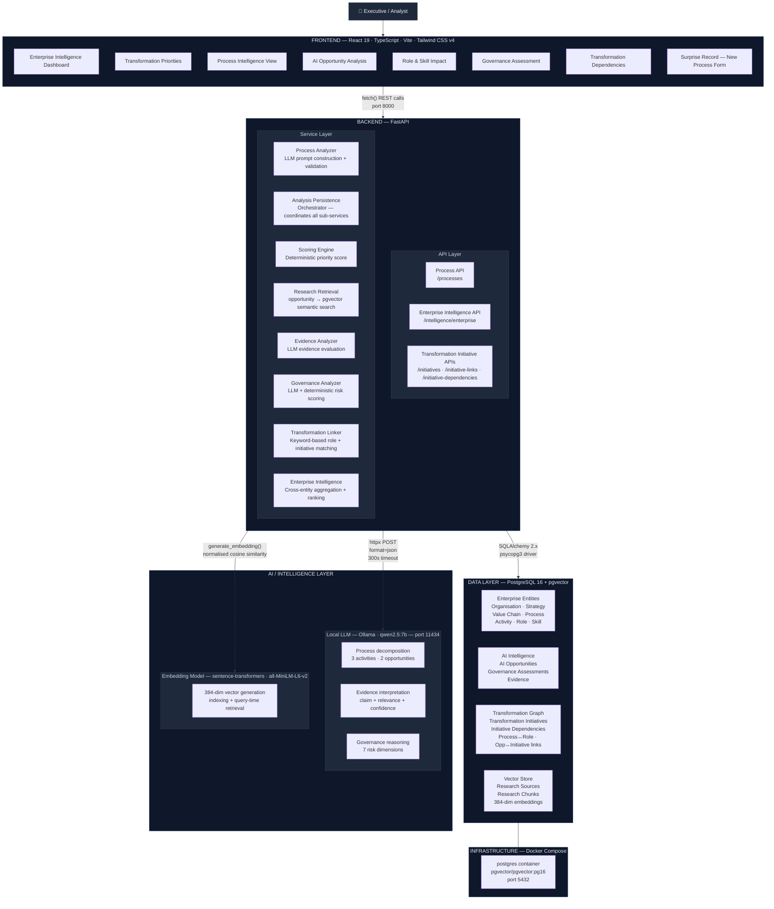

```mermaid
flowchart TD

    %% ── ENTRY POINTS ──────────────────────────────────────────────
    USER_EX["👤  Executive — selects existing process"]
    USER_SR["👤  Analyst — Surprise Record new process form"]

    subgraph ENTRY["Entry Points"]
        direction LR
        USER_EX
        USER_SR
    end

    API_GATE["FastAPI\nPOST /processes/analyze-new\nPOST /processes/{id}/analyze"]

    %% ── LLM PROCESS DECOMPOSITION ─────────────────────────────────
    subgraph LLM1["① LLM Call — Process Decomposition\nOllama · qwen2.5:7b"]
        direction TB
        L1_IN["Input: name · description\nbusiness_purpose · current_challenges"]
        L1_OUT["Output: process summary\n3 activities · 2 AI opportunities\nraw factor scores  [0–1]"]
        L1_VAL["Pydantic validation\nProcessAnalysis.model_validate()"]
        L1_IN --> L1_OUT --> L1_VAL
    end

    ACTIVITIES["Activities\nname · description · sequence\nactivity_type · decision_required"]
    AI_OPPS["AI Opportunities\nname · description · ai_capability\nautomation_potential · human_involvement\nexpected_benefit · feasibility\nstrategic_alignment · risk_level · reasoning"]

    %% ── DETERMINISTIC SCORING ─────────────────────────────────────
    subgraph SCORING["② Deterministic Priority Scoring\nscoring_engine.py — FastAPI Backend"]
        direction TB
        SC_F["Input factors from LLM"]
        SC_C["Priority Score = backend formula\n0.20×automation + 0.10×(1−human_involvement)\n+ 0.25×benefit + 0.20×feasibility\n+ 0.20×strategic_alignment + 0.05×(1−risk)"]
        SC_F --> SC_C
    end

    %% ── RAG RETRIEVAL ─────────────────────────────────────────────
    subgraph RAG["③ Research Retrieval  —  Pre-Indexed RAG"]
        direction LR
        subgraph PREINDEX["Pre-Indexing  (run separately)"]
            PI1["Research Source URL"]
            PI2["HTML extraction\nBeautifulSoup"]
            PI3["Chunking\n1200 chars · 200 overlap"]
            PI4["Sentence Transformers\nall-MiniLM-L6-v2\n384-dim embedding"]
            PI5["pgvector\nResearchChunk stored"]
            PI1 --> PI2 --> PI3 --> PI4 --> PI5
        end
        subgraph RETRIEVAL["Analysis-Time Retrieval"]
            RET1["Opportunity query string\nname + description + ai_capability"]
            RET2["generate_embedding(query)\n384-dim vector"]
            RET3["pgvector cosine distance\nSELECT top-3 chunks"]
            RET1 --> RET2 --> RET3
        end
    end

    DISCONNECTED["⚠  DuckDuckGo live web search\nImplemented · currently disconnected\nfrom the active analysis runtime"]

    %% ── LLM EVIDENCE ANALYSIS ────────────────────────────────────
    subgraph LLM2["④ LLM Call — Evidence Analysis\nOllama · qwen2.5:7b  ×3 per opportunity"]
        direction TB
        L2_IN["Input: opportunity + chunk content + source"]
        L2_OUT["Output: claim\nsupporting_excerpt\nrelevance_score · confidence_score"]
        L2_VAL["Pydantic validation\nEvidenceAnalysis.model_validate()"]
        L2_IN --> L2_OUT --> L2_VAL
    end

    EVIDENCE["Evidence\nclaim · excerpt\nrelevance_score · confidence_score"]

    %% ── LLM GOVERNANCE ──────────────────────────────────────────
    subgraph LLM3["⑤ LLM Call — Governance Assessment\nOllama · qwen2.5:7b  ×1 per opportunity"]
        direction TB
        L3_IN["Input: all opportunity scored factors"]
        L3_OUT["Output: data_risk · privacy_risk · bias_risk\nsecurity_risk · decision_impact\nregulatory_exposure · model_risk\noversight_requirement · reasoning"]
        L3_VAL["Pydantic validation\nGovernanceAnalysis.model_validate()"]
        L3_IN --> L3_OUT --> L3_VAL
    end

    subgraph GOV_SCORE["⑥ Deterministic Governance Risk\ngovernance_scoring.py — FastAPI Backend"]
        direction TB
        GS_F["7 LLM risk dimensions"]
        GS_C["Overall Risk = backend formula\n0.15×data + 0.15×privacy + 0.10×bias\n+ 0.10×security + 0.20×decision_impact\n+ 0.20×regulatory_exposure + 0.10×model"]
        GS_F --> GS_C
    end

    GOV_RESULT["Governance Assessment\noverall_risk · all 7 dimensions\noversight_required · explainability_required"]

    %% ── TRANSFORMATION LINKING ───────────────────────────────────
    subgraph LINKING["⑦ Transformation Linking\ntransformation_linker.py — FastAPI Backend\nKeyword scoring — no LLM"]
        direction LR
        LNK_ROLE["link_roles_to_process()\nToken overlap + keyword boost\nup to 3 roles per process"]
        LNK_INIT["link_opportunities_to_initiatives()\nDomain rule scoring\nup to 2 initiatives per opportunity"]
    end

    ROLES["Roles + Skills\nProcess ↔ Role ↔ Skill\nkeyword-matched"]
    INITS["Transformation Initiatives\nopportunity ↔ initiative\nrelationship_type: supports |\ngovernance_prerequisite |\ndata_prerequisite"]
    DEPS["Initiative Dependencies\ninit → depends_on → init\nrecursive chain"]

    %% ── PERSISTENCE ──────────────────────────────────────────────
    subgraph PERSIST["⑧ Persist to PostgreSQL\nCoordinated by analysis_persistence.py"]
        direction LR
        PG["PostgreSQL 16\n+ pgvector\nNote: evidence sub-steps may commit internally"]
    end

    %% ── DATA GRAPH ───────────────────────────────────────────────
    subgraph DATAGRAPH["Database Knowledge Graph"]
        direction TB
        DG_ORG["Organisation"]
        DG_STR["Strategy"]
        DG_VC["Value Chain Stage"]
        DG_P["Process"]
        DG_A["Activity"]
        DG_O["AI Opportunity"]
        DG_EV["Evidence → Research Source"]
        DG_GV["Governance Assessment"]
        DG_RL["Role → Skill"]
        DG_TI["Transformation Initiative"]
        DG_DEP["↺ Initiative Dependency"]

        DG_ORG --> DG_STR
        DG_ORG --> DG_VC
        DG_VC --> DG_P
        DG_P --> DG_A
        DG_A --> DG_O
        DG_P --> DG_RL
        DG_O --> DG_EV
        DG_O --> DG_GV
        DG_O --> DG_TI
        DG_TI --> DG_DEP
    end

    %% ── ENTERPRISE INTELLIGENCE ──────────────────────────────────
    ENT_INT["Enterprise Intelligence\nRanked processes · ranked opportunities\nRole↔skill graph · initiative chains\nIntelligence gaps · transformation priorities"]

    DASHBOARD["📊  Executive Dashboard\nEnterprise view · Process drill-down\nOpportunity drawer · Governance · Dependencies"]

    %% ── FLOW ─────────────────────────────────────────────────────
    ENTRY --> API_GATE
    API_GATE --> LLM1
    LLM1 --> ACTIVITIES
    LLM1 --> AI_OPPS
    AI_OPPS --> SCORING
    SCORING --> RAG
    RAG --> LLM2
    LLM2 --> EVIDENCE
    AI_OPPS --> LLM3
    LLM3 --> GOV_SCORE
    GOV_SCORE --> GOV_RESULT
    SCORING --> LINKING
    EVIDENCE --> LINKING
    GOV_RESULT --> LINKING
    LINKING --> ROLES
    LINKING --> INITS
    INITS --> DEPS
    ROLES --> PERSIST
    INITS --> PERSIST
    DEPS --> PERSIST
    EVIDENCE --> PERSIST
    GOV_RESULT --> PERSIST
    AI_OPPS --> PERSIST
    ACTIVITIES --> PERSIST
    PERSIST --> DATAGRAPH
    DATAGRAPH --> ENT_INT
    ENT_INT --> DASHBOARD

    DISCONNECTED -. "not connected\nto active pipeline" .-> RAG

    %% ── RESPONSIBILITY LEGEND ─────────────────────────────────────
    subgraph LEGEND["Responsibility Separation"]
        direction LR
        LEG_LLM["🟦  LLM  —  Ollama / qwen2.5:7b\nProcess decomposition\nEvidence interpretation\nGovernance reasoning\nRaw factor estimation"]
        LEG_BE["🟩  Backend  —  FastAPI\nPydantic validation\nPipeline orchestration\nDeterministic scoring\nRelationship management\nDatabase persistence"]
        LEG_DB["🟫  Database  —  PostgreSQL + pgvector\nSource of truth\nKnowledge graph\nResearch embeddings\nHistorical intelligence"]
    end

    style ENTRY fill:#1e293b,color:#e2e8f0,stroke:#334155
    style LLM1 fill:#1e3a5f,color:#bfdbfe,stroke:#2563eb
    style LLM2 fill:#1e3a5f,color:#bfdbfe,stroke:#2563eb
    style LLM3 fill:#1e3a5f,color:#bfdbfe,stroke:#2563eb
    style SCORING fill:#14532d,color:#bbf7d0,stroke:#16a34a
    style GOV_SCORE fill:#14532d,color:#bbf7d0,stroke:#16a34a
    style LINKING fill:#14532d,color:#bbf7d0,stroke:#16a34a
    style RAG fill:#1e293b,color:#e2e8f0,stroke:#334155
    style PREINDEX fill:#0f172a,color:#94a3b8,stroke:#1e293b
    style RETRIEVAL fill:#0f172a,color:#94a3b8,stroke:#1e293b
    style PERSIST fill:#3b1f00,color:#fed7aa,stroke:#92400e
    style DATAGRAPH fill:#3b1f00,color:#fed7aa,stroke:#92400e
    style LEGEND fill:#0f172a,color:#94a3b8,stroke:#1e293b
    style DISCONNECTED fill:#3b0000,color:#fca5a5,stroke:#991b1b
    style LEG_LLM fill:#1e3a5f,color:#bfdbfe,stroke:#2563eb
    style LEG_BE fill:#14532d,color:#bbf7d0,stroke:#16a34a
    style LEG_DB fill:#3b1f00,color:#fed7aa,stroke:#92400e
    style DASHBOARD fill:#1e293b,color:#e2e8f0,stroke:#334155
    style ENT_INT fill:#1e293b,color:#e2e8f0,stroke:#334155
```

# NovaAI — Architecture Diagrams

---

## Diagram 1 — System Architecture

### What this diagram represents

This diagram shows the **actual runtime topology** of NovaAI as it runs today. Five layers are connected in a linear hierarchy: an executive user interacts with a React single-page application, which calls a FastAPI backend, which orchestrates a local Ollama LLM and a sentence-transformers embedding model, all backed by PostgreSQL 16 with the pgvector extension. Docker Compose runs the database container; everything else runs as local processes.

### The most important architectural decision

**The LLM handles reasoning. The backend handles authority.**

Ollama/qwen2.5:7b generates qualitative analysis and raw numeric estimates. The FastAPI backend validates every LLM response with Pydantic, then *recalculates* all final scores using its own deterministic formulas with explicit weights. The LLM can never directly set a priority score or governance risk level — it can only provide inputs that the backend scores. This makes the system auditable, reproducible, and safe for enterprise use.

### Why LLM reasoning is separated from deterministic backend logic

LLMs are probabilistic — the same prompt can return different numbers across calls. Business decisions about *which process to invest in* or *which AI opportunity has the highest risk* must be reproducible and explainable to executives, auditors, and regulators. Separating LLM reasoning from backend scoring means you can change the weighting policy without touching the LLM, and you can explain every priority number with a transparent formula.

### How persistence and relationships make this an intelligence platform

A chatbot forgets everything between sessions. NovaAI persists a **knowledge graph**: processes connect to activities, activities connect to AI opportunities, opportunities connect to evidence, governance assessments, and transformation initiatives, which in turn chain to each other through dependencies. The enterprise intelligence endpoint reads this entire graph and produces cross-entity rankings. The result is accumulated organisational intelligence — not a one-shot query.

---

---
---

## Diagram 2 — AI / Intelligence Data Flow Pipeline

### What this diagram represents

This diagram traces the **complete data journey** for a single process analysis — from user input to executive dashboard. It covers two entry points (existing process and Surprise Record), the three LLM call sites, the pgvector RAG retrieval path, deterministic scoring, transformation linking, database persistence, and enterprise intelligence aggregation.

### The most important architectural decision

**The analysis pipeline is synchronous and centrally orchestrated, with persistence coordinated through the analysis persistence layer.**

`analysis_persistence.py` is the central orchestrator. It calls the LLM three times (process decomposition, evidence evaluation × 3 chunks per opportunity, governance assessment), runs the deterministic scoring engines, and links roles and initiatives. Persistence is coordinated through the analysis persistence layer, with a final `db.commit()` at the end of the main flow. Note: research chunk persistence can commit internally during evidence storage, so individual sub-steps may not all share a single transaction boundary.

### Why LLM reasoning is separated from deterministic backend logic

The LLM's job is to *reason about* an opportunity — to generate a description, identify the AI capability type, and estimate raw risk factors. The backend's job is to *calculate* the final scores using a transparent, auditable formula. If a compliance officer asks "why did this opportunity score 73/100?", the answer is a formula with explicit weights — not "the AI said so." This separation is what makes NovaAI usable for governance-sensitive enterprise decisions.

### How persistence and relationships make this an intelligence platform

After each analysis, the knowledge graph grows. The enterprise intelligence endpoint reads all processes, all opportunities, all roles, all initiatives, and all dependency chains simultaneously and returns ranked, cross-entity intelligence. The dashboard surfaces patterns that cannot be seen from any single process — which opportunity types appear most often, which initiatives are blocked by the most dependencies, which roles are most affected. That cross-entity reasoning is only possible because every analysis persists structured relationships — not just text — into PostgreSQL.

---

---

## Colour Key

| Colour | Responsibility |
|--------|---------------|
| 🟦 Blue | LLM reasoning (Ollama / qwen2.5:7b) |
| 🟩 Green | Backend deterministic logic (FastAPI) |
| 🟫 Amber | Database persistence (PostgreSQL + pgvector) |
| 🔴 Red | Implemented but disconnected from active runtime |

---

## Key Architectural Facts

| Fact | Detail |
|------|--------|
| LLM calls per analysis | Up to 9 (1 decomposition + 6 evidence + 2 governance) |
| LLM model | qwen2.5:7b via Ollama, local, port 11434 |
| Priority score formula | 0.20×automation + 0.10×(1−human) + 0.25×benefit + 0.20×feasibility + 0.20×strategic + 0.05×(1−risk) |
| Governance risk formula | 0.15×data + 0.15×privacy + 0.10×bias + 0.10×security + 0.20×decision_impact + 0.20×regulatory + 0.10×model |
| Embedding model | sentence-transformers/all-MiniLM-L6-v2, 384 dimensions, cosine similarity |
| Research retrieval | Top-3 pre-indexed chunks via pgvector cosine distance |
| Transformation linking | Pure keyword/token scoring — zero LLM involvement |
| Database commit strategy | Final `db.commit()` coordinated by `persist_analysis()`; research chunk sub-steps may commit internally |
| Entity relationship depth | Organisation → Strategy / Value Chain → Process → Activity → AI Opportunity → Evidence / Governance / Initiative → Dependency |
| Frontend → backend | 3 fetch() calls: process intelligence, enterprise intelligence, analyze-new |
